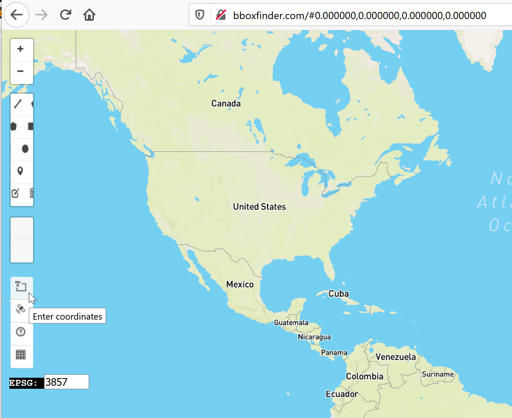
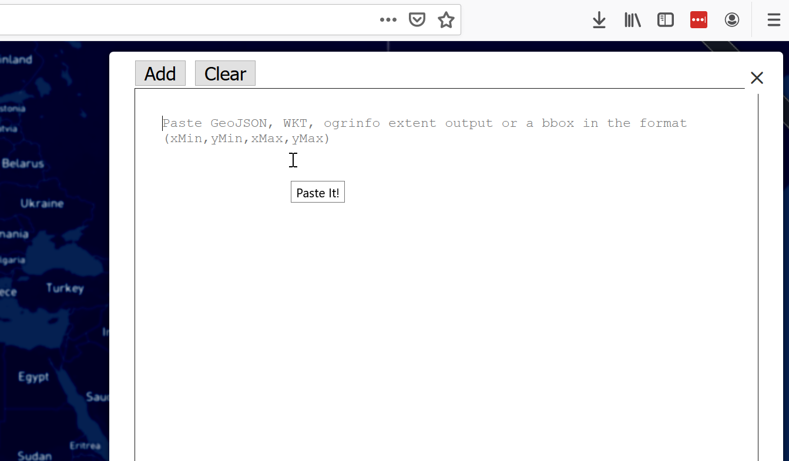
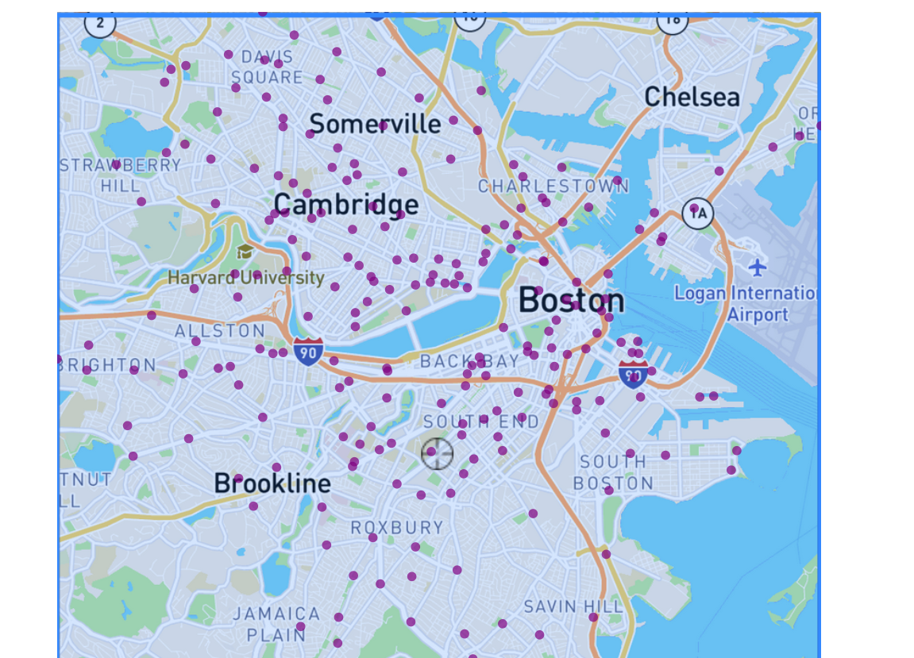

# In-Class Programming: Blue Bikes
In this activity, you are going to create a spatial visualization the easy way.  More specifically, we'll build a scatterplot with a map background, so that the points that are overlaid have spatial significance.

## Data

We will be visualizing publicly available data from BlueBikes, the bike share program around the Boston area.  To prepare for this assignment, we downloaded [publicly available data from BlueBikes](https://www.bluebikes.com/system-data), including all bike rentals in the month of March, 2017.  We then grouped by the station names, and got counts of the incoming and outgoing rentals at each location. 

When you are finished with the in-class assignment, please publish to github pages and post the link below:

GITHUB_PAGES_LINK

## Setup
1. Clone this repository to your local machine. E.g., in your terminal / command prompt `CD` to where you want this the folder for this activity to be. Then run `git clone <YOUR_REPO_URL>`

1. `CD` or open a terminal / command prompt window into the cloned folder.

1. Start a simple python webserver. E.g., `python -m http.server`, `python3 -m http.server`, or `py -m http.server`. If you are using python 2 you will need to use `python -m SimpleHTTPServer` instead, but please switch to python 3.

1. Wait for the output: `Serving HTTP on 0.0.0.0 port 8000 (http://0.0.0.0:8000/)`.

1. Now open your web browser (Firefox or Chrome) and navigate to the URL: http://localhost:8000

## Adding the map background

You should see a plain scatterplot on the page.  If you look into the code, you'll see that we're parsing the `data/march2017_bluebikes_trip_counts.csv` file, and mapping the `latitude` and `longitude` to the `x` and `y` axes respectively.  Your first task is to find an image of the map of Boston that can be used as a background to this scatterplot.  To do this, we're going to use an online tool that draws bounding boxes on maps using the latitude and longitude of the upper-left-most corner and lower-right-most corner.

First, we need to determine what the bounding box of our map area should be.  Looking into `spatial.js`, you'll see that we output the minimum and maximum latitudes and longitudes into the console:

    console.log("minX is ", minX);
    console.log("minY is ", minY);
    console.log("maxX is ", maxX);
    console.log("maxY is ", maxY);

In your browser, open the javascript console and look at what the corresponding values are for the bounding box coordinates.  Then, go to the site [bboxfinder.com](http://bboxfinder.com/), and enter your bounding box coordinates.  First, click on the bounding box selector on the left side of the page.

Then, paste your bounding box coordinates in the form (minX, minY, maxX, maxY), and click "Add".

You will be brought to a rectangular bounding box highlighted in blue.  Take a cropped screenshot of that box ([instructions for Windows 10](https://support.microsoft.com/en-us/help/4027213/windows-10-open-snipping-tool-and-take-a-screenshot), [instructions for OS X](https://support.apple.com/en-us/HT201361)).  Save that image into the root folder of this assignment, and pass the filename into the background image field in `visualization.js`.

    let spatialPlot = spatial({
        'backgroundImage': 'my-awesome-image.png'
      })

Lastly, you need to resize your SVG so that it has the same dimensions as your screenshot.  Determine the size of your screenshot by right clicking on your image, going to properties, and finding the width and height of the image in pixels.  Then, change the width and height in `spatial.js` to those dimensions.  At this point, your map should look like this:

## Visualizing activity per station

Now that we have a scatterplot built on top of a map, let's use an additional visual channel to communicate another attribute.  We're going to map the radius of each point to correspond to the number of trips started at that location.

First, read through the code that creates the scatterplot in `spatial.js`.  In particular, look at lines 63-104, where the `xScale` and `yScale` are initialized, and then those scales are used to map from the latitude and longitude values of each line of data into the pixel values fed to the `cx` and `cy` attributes of each scatter point.  We want to modify this code so that it uses the data to calculate a different radius for each point based on its number of trips.  To do that, we'll need a scale for the radius `rScale`, and then we'll need to use that `rScale` to set the radius of each point.

In `spatial.js`, note that there's a commented out scale used for the radius around line 85, along with the scales for the x and y axes.  Uncomment that scale out, and then switch out the line around line 103 that sets the radius to `5` for the line that uses that `rScale` just below it.  Reload your web page and take a look at what we have.

Note that the choice for the radius scale is not great - some of the radii are way too large, and cause occlusion.  Change the definition of the radius scale around line 90 to make the scale return more reasonable radii.  Which aspect of the scale is responsible: the domain or the range?

## Extra credit

For up to 1 point extra credit, try to visualize both the trip start count and the trip end count in a reasonable way on each point in the scatter plot.  
